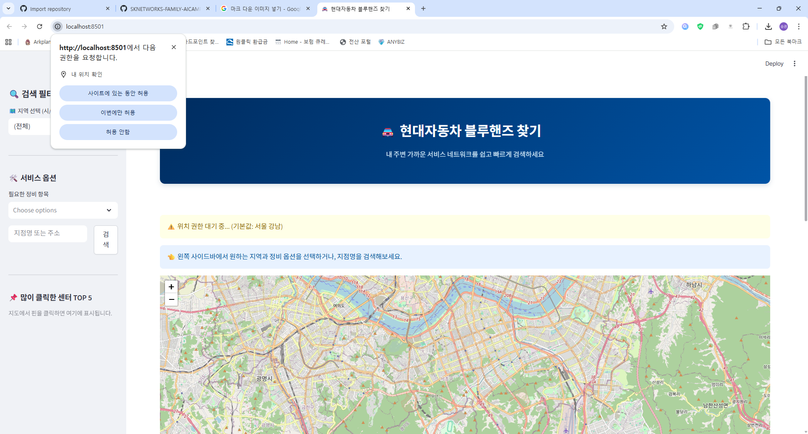
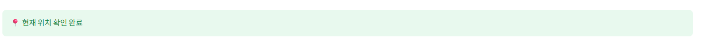
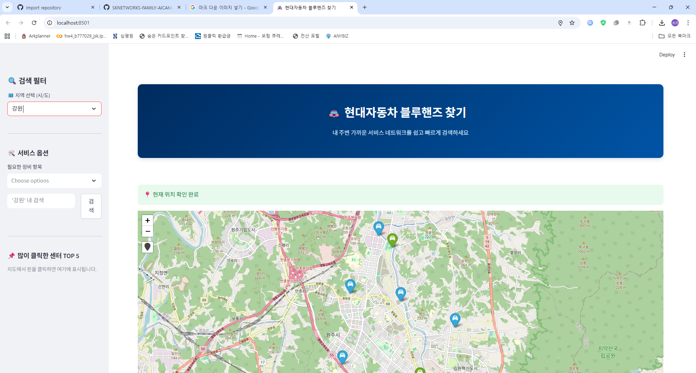
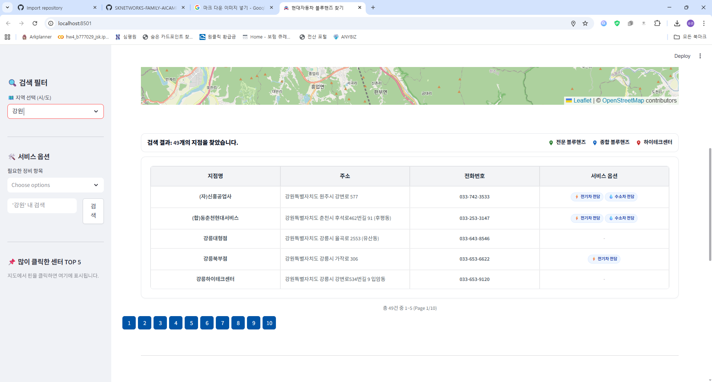
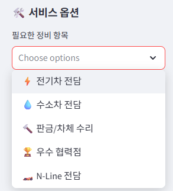
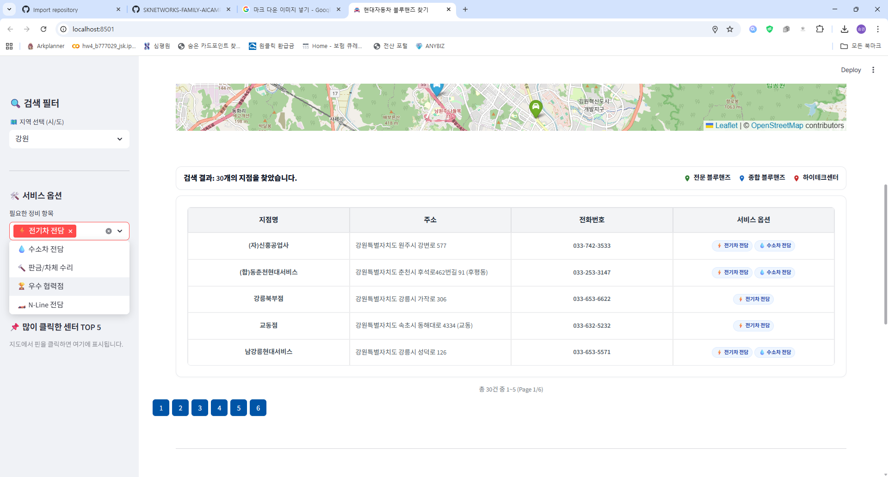
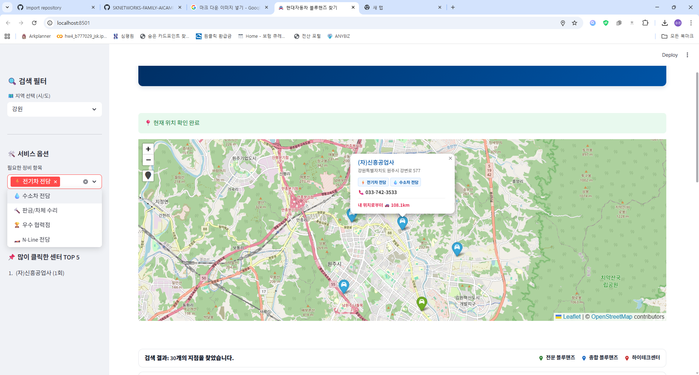

<p align="center">
  
</p>

# 🚘 블루핸즈 통합 검색 서비스 (Bluehands Finder)

사용자의 현재 위치 또는 선택한 지역을 기반으로 **현대자동차 블루핸즈(Bluehands)** 정비소를 조회하고, 원하는 정비 옵션(전기차, 수소차, 판금 등)별로 필터링하여 지도와 목록으로 보여주는 웹 애플리케이션입니다.

## ✨ 주요 기능

* **🗺️ 지도 시각화**: Folium 지도를 통해 지점의 위치를 마커로 표시하고, 클릭 시 상세 정보를 제공합니다.
* **🔍 상세 필터링**:
    * **지역 선택**: 시/도 단위로 검색 범위를 설정할 수 있습니다.
    * **서비스 옵션**: 전기차, 수소차, 판금, N-Line 전담 등 특수 정비 가능 여부로 필터링합니다.
* **📃 깔끔한 결과 목록**: 커스텀 HTML/CSS가 적용된 테이블과 페이지네이션 기능을 통해 검색 결과를 보기 쉽게 제공합니다.
* **📱 반응형 UI**: 사이드바를 활용하여 PC와 모바일 환경 모두에서 편리하게 사용할 수 있습니다.

## 🛠️ 기술 스택 (Tech Stack)

* **Python**: 3.10+
* **Web Framework**: [Streamlit](https://streamlit.io/)
* **Database**: MySQL (8.0+)
* **Libraries**:
    * `folium`, `streamlit-folium`: 지도 시각화
    * `mysql-connector-python`: DB 연동
    * `streamlit-js-eval`: GPS 위치 정보 수집
    * `pandas`: 데이터 처리

## ⚙️ 설치 및 실행 방법

### 1. 환경 설정 및 패키지 설치
```bash
# 필수 라이브러리 설치
pip install streamlit mysql-connector-python pandas folium streamlit-folium streamlit-js-eval
```

2. 데이터베이스 설정 (MySQL)
프로젝트 실행을 위해 MySQL에 데이터베이스와 테이블이 생성되어 있어야 합니다.
```sql
CREATE DATABASE IF NOT EXISTS bluehands_db;
USE bluehands_db;

-- 1. 지역 테이블
CREATE TABLE regions (
    id INT AUTO_INCREMENT PRIMARY KEY,
    name VARCHAR(50) NOT NULL
);

-- 2. 블루핸즈 테이블
CREATE TABLE bluehands (
    id INT AUTO_INCREMENT PRIMARY KEY,
    name VARCHAR(100) NOT NULL,
    address VARCHAR(255),
    phone VARCHAR(50),
    latitude DOUBLE,
    longitude DOUBLE,
    region_id INT,
    is_ev TINYINT(1) DEFAULT 0,        -- 전기차 전담
    is_hydrogen TINYINT(1) DEFAULT 0,  -- 수소차 전담
    is_frame TINYINT(1) DEFAULT 0,     -- 판금/차체
    is_excellent TINYINT(1) DEFAULT 0, -- 우수 협력점
    is_n_line TINYINT(1) DEFAULT 0,    -- N-Line 전담
    FOREIGN KEY (region_id) REFERENCES regions(id)
);
```
3. DB 연결 정보 수정
소스 코드 내의 DB_CONFIG 딕셔너리를 본인의 MySQL 환경에 맞게 수정해주세요.

### main.py (또는 해당 파일의 내용 수정)
DB_CONFIG = {
    "host": "localhost",
    "user": "root",           # 본인의 MySQL 유저명
    "password": "your_password", # 본인의 MySQL 비밀번호
    "database": "bluehands_db",
    "charset": "utf8mb4",
}

4. 애플리케이션 실행
```bash
streamlit run final.py # 최종 실행 파일은 final.py 입니다.
 ```

```📂 프로젝트 구조
📦 bluehands-finder
 ┣ 📜 final.py          # 메인 애플리케이션 소스 코드
 ┣ 📜 elses             #
 ┗ 📜 README.md        # 프로젝트 설명서
```
---

# 실행 결과 

## 메인 화면 

## 위치 확인 시그널

## 사이드바 검색 기능

## 검색결과는 하단부 테이블출력


## 옵션 검색
<p align="center">
  
</p>

## 해당되는 센터만 출력 


## 지도 마커 클릭시 기록 저장


## 🫱🏻팀원 회고

<table style="width: 100%; border-collapse: collapse; border: 1px solid #ddd; margin-bottom: 30px;">
    <thead>
        <tr style="background-color: #f8f9fa;">
            <th style="width: 15%; border: 1px solid #ddd; padding: 10px;">작성자</th>
            <th style="width: 15%; border: 1px solid #ddd; padding: 10px;">대상자</th>
            <th style="border: 1px solid #ddd; padding: 10px;">회고 내용</th>
        </tr>
    </thead>
    <tbody>
        <tr>
            <td rowspan="5" style="text-align: center; font-weight: bold; border: 1px solid #ddd;">전승권</td>
            <td style="text-align: center; border: 1px solid #ddd;">김용욱</td>
            <td style="border: 1px solid #ddd; padding: 10px;">발표 기반 PPT를 전담해서 준비해주셨습니다. 결과물을 전달 가능한 형태로 정리하는 역할은 프로젝트 마무리의 핵심인데, 그 부분을 책임지고 처리해줘서 발표 준비 부담이 크게 줄었습니다. “만들었다”에서 끝나지 않고 “설명할 수 있는 결과”로 완성시키는 데 기여했습니다.</td>
        </tr>
        <tr>
            <td style="text-align: center; border: 1px solid #ddd;">김이선</td>
            <td style="border: 1px solid #ddd; padding: 10px;">DB 의 구조를 확실히 파악하고 응용하는 방법을 아시기에 검색 기능 을 구현해주셨습니다. 자신이 해야할것도 뛰어 넘어 더 하는 모습을 보여줘서 인상이 깊었습니다.</td>
        </tr>
        <tr>
            <td style="text-align: center; border: 1px solid #ddd;">위희찬</td>
            <td style="border: 1px solid #ddd; padding: 10px;">구조 설계 파트를 맡아 크롤링.py와 스키마, DB 테이블 기초 구축을 책임졌습니다. 기반 틀이 빠르게 완성된 덕분에 후속 작업이 막히지 않고 진행됐습니다. 초반 설계를 제대로 잡아준 것이 전체 일정 안정화에 크게 기여했습니다. 그리고 코드 안정화에도 도움을 많이 주셨습니다.</td>
        </tr>
        <tr>
            <td style="text-align: center; border: 1px solid #ddd;">이선호</td>
            <td style="border: 1px solid #ddd; padding: 10px;">처음부터 완벽하게 따라오기보다는, 부족한 부분을 인지하고 학습으로 메우려는 태도가 분명했습니다. 열정적으로 공부하면서 팀 흐름에 맞추려 노력했고, 그 과정에서 성장 가능성이 뚜렷하게 보였습니다. 프로젝트 경험을 통해 속도가 더 붙을 타입입니다.</td>
        </tr>
        <tr>
            <td style="text-align: center; border: 1px solid #ddd;">전종혁</td>
            <td style="border: 1px solid #ddd; padding: 10px;">프로젝트 기여도가 압도적으로 높았습니다. 전체 개발의 90% 이상을 실질적으로 밀어붙였고, Streamlit 활용 능력도 상당했습니다. 코드를 작성하자마자 바로 실행하면서 즉시 검증하는 습관이 인상적이었고, 그 과정 자체가 코드 리뷰 역할을 했습니다. 속도와 열정 모두 팀을 끌어올린 핵심 요인이었습니다.</td>
        </tr>
    </tbody>
</table>

<table style="width: 100%; border-collapse: collapse; border: 1px solid #ddd; margin-bottom: 30px;">
    <thead>
        <tr style="background-color: #f8f9fa;">
            <th style="width: 15%; border: 1px solid #ddd; padding: 10px;">작성자</th>
            <th style="width: 15%; border: 1px solid #ddd; padding: 10px;">대상자</th>
            <th style="border: 1px solid #ddd; padding: 10px;">회고 내용</th>
        </tr>
    </thead>
    <tbody>
        <tr>
            <td rowspan="5" style="text-align: center; font-weight: bold; border: 1px solid #ddd;">김용욱</td>
            <td style="text-align: center; border: 1px solid #ddd;">전승권</td>
            <td style="border: 1px solid #ddd; padding: 10px;">작성해주실곳</td>
        </tr>
        <tr>
            <td style="text-align: center; border: 1px solid #ddd;">김이선</td>
            <td style="border: 1px solid #ddd; padding: 10px;">작성해주실곳</td>
        </tr>
        <tr>
            <td style="text-align: center; border: 1px solid #ddd;">위희찬</td>
            <td style="border: 1px solid #ddd; padding: 10px;">작성해주실곳</td>
        </tr>
        <tr>
            <td style="text-align: center; border: 1px solid #ddd;">이선호</td>
            <td style="border: 1px solid #ddd; padding: 10px;">작성해주실곳</td>
        </tr>
        <tr>
            <td style="text-align: center; border: 1px solid #ddd;">전종혁</td>
            <td style="border: 1px solid #ddd; padding: 10px;">작성해주실곳</td>
        </tr>
    </tbody>
</table>

<table style="width: 100%; border-collapse: collapse; border: 1px solid #ddd; margin-bottom: 30px;">
    <thead>
        <tr style="background-color: #f8f9fa;">
            <th style="width: 15%; border: 1px solid #ddd; padding: 10px;">작성자</th>
            <th style="width: 15%; border: 1px solid #ddd; padding: 10px;">대상자</th>
            <th style="border: 1px solid #ddd; padding: 10px;">회고 내용</th>
        </tr>
    </thead>
    <tbody>
        <tr>
            <td rowspan="5" style="text-align: center; font-weight: bold; border: 1px solid #ddd;">김이선</td>
            <td style="text-align: center; border: 1px solid #ddd;">김용욱</td>
            <td style="border: 1px solid #ddd; padding: 10px;">작성해주실곳</td>
        </tr>
        <tr>
            <td style="text-align: center; border: 1px solid #ddd;">전승권</td>
            <td style="border: 1px solid #ddd; padding: 10px;">작성해주실곳</td>
        </tr>
        <tr>
            <td style="text-align: center; border: 1px solid #ddd;">위희찬</td>
            <td style="border: 1px solid #ddd; padding: 10px;">작성해주실곳</td>
        </tr>
        <tr>
            <td style="text-align: center; border: 1px solid #ddd;">이선호</td>
            <td style="border: 1px solid #ddd; padding: 10px;">작성해주실곳</td>
        </tr>
        <tr>
            <td style="text-align: center; border: 1px solid #ddd;">전종혁</td>
            <td style="border: 1px solid #ddd; padding: 10px;">작성해주실곳</td>
        </tr>
    </tbody>
</table>

<table style="width: 100%; border-collapse: collapse; border: 1px solid #ddd; margin-bottom: 30px;">
    <thead>
        <tr style="background-color: #f8f9fa;">
            <th style="width: 15%; border: 1px solid #ddd; padding: 10px;">대상자</th>
            <th style="width: 15%; border: 1px solid #ddd; padding: 10px;">작성자</th>
            <th style="border: 1px solid #ddd; padding: 10px;">회고 내용</th>
        </tr>
    </thead>
    <tbody>
        <tr>
            <td rowspan="5" style="text-align: center; font-weight: bold; border: 1px solid #ddd;">위희찬</td>
            <td style="text-align: center; border: 1px solid #ddd;">김용욱</td>
            <td style="border: 1px solid #ddd; padding: 10px;">작성해주실곳</td>
        </tr>
        <tr>
            <td style="text-align: center; border: 1px solid #ddd;">김이선</td>
            <td style="border: 1px solid #ddd; padding: 10px;">작성해주실곳</td>
        </tr>
        <tr>
            <td style="text-align: center; border: 1px solid #ddd;">전승권</td>
            <td style="border: 1px solid #ddd; padding: 10px;">작성해주실곳</td>
        </tr>
        <tr>
            <td style="text-align: center; border: 1px solid #ddd;">이선호</td>
            <td style="border: 1px solid #ddd; padding: 10px;">작성해주실곳</td>
        </tr>
        <tr>
            <td style="text-align: center; border: 1px solid #ddd;">전종혁</td>
            <td style="border: 1px solid #ddd; padding: 10px;">작성해주실곳</td>
        </tr>
    </tbody>
</table>

<table style="width: 100%; border-collapse: collapse; border: 1px solid #ddd; margin-bottom: 30px;">
    <thead>
        <tr style="background-color: #f8f9fa;">
            <th style="width: 15%; border: 1px solid #ddd; padding: 10px;">작성자</th>
            <th style="width: 15%; border: 1px solid #ddd; padding: 10px;">대상자</th>
            <th style="border: 1px solid #ddd; padding: 10px;">회고 내용</th>
        </tr>
    </thead>
    <tbody>
        <tr>
            <td rowspan="5" style="text-align: center; font-weight: bold; border: 1px solid #ddd;">이선호</td>
            <td style="text-align: center; border: 1px solid #ddd;">김용욱</td>
            <td style="border: 1px solid #ddd; padding: 10px;">작성해주실곳</td>
        </tr>
        <tr>
            <td style="text-align: center; border: 1px solid #ddd;">김이선</td>
            <td style="border: 1px solid #ddd; padding: 10px;">작성해주실곳</td>
        </tr>
        <tr>
            <td style="text-align: center; border: 1px solid #ddd;">위희찬</td>
            <td style="border: 1px solid #ddd; padding: 10px;">작성해주실곳</td>
        </tr>
        <tr>
            <td style="text-align: center; border: 1px solid #ddd;">전승권</td>
            <td style="border: 1px solid #ddd; padding: 10px;">작성해주실곳</td>
        </tr>
        <tr>
            <td style="text-align: center; border: 1px solid #ddd;">전종혁</td>
            <td style="border: 1px solid #ddd; padding: 10px;">작성해주실곳</td>
        </tr>
    </tbody>
</table>

<table style="width: 100%; border-collapse: collapse; border: 1px solid #ddd; margin-bottom: 30px;">
    <thead>
        <tr style="background-color: #f8f9fa;">
            <th style="width: 15%; border: 1px solid #ddd; padding: 10px;">작성자</th>
            <th style="width: 15%; border: 1px solid #ddd; padding: 10px;">대상자</th>
            <th style="border: 1px solid #ddd; padding: 10px;">회고 내용</th>
        </tr>
    </thead>
    <tbody>
        <tr>
            <td rowspan="5" style="text-align: center; font-weight: bold; border: 1px solid #ddd;">전종혁</td>
            <td style="text-align: center; border: 1px solid #ddd;">김용욱</td>
            <td style="border: 1px solid #ddd; padding: 10px;">작성해주실곳</td>
        </tr>
        <tr>
            <td style="text-align: center; border: 1px solid #ddd;">김이선</td>
            <td style="border: 1px solid #ddd; padding: 10px;">작성해주실곳</td>
        </tr>
        <tr>
            <td style="text-align: center; border: 1px solid #ddd;">위희찬</td>
            <td style="border: 1px solid #ddd; padding: 10px;">작성해주실곳</td>
        </tr>
        <tr>
            <td style="text-align: center; border: 1px solid #ddd;">이선호</td>
            <td style="border: 1px solid #ddd; padding: 10px;">작성해주실곳</td>
        </tr>
        <tr>
            <td style="text-align: center; border: 1px solid #ddd;">전승권</td>
            <td style="border: 1px solid #ddd; padding: 10px;">작성해주실곳</td>
        </tr>
    </tbody>
</table>
